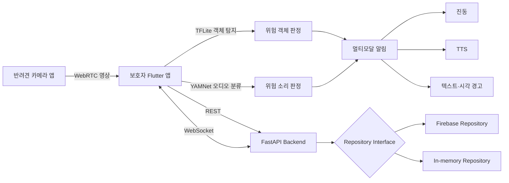

# TogeDog System Architecture

## 전체 흐름

## 컴포넌트 책임

| 컴포넌트 | 책임 |
|---|---|
| Camera App | 반려견 시점 영상 송출 및 카메라 프로토타입 |
| Mobile App | 산책 세션, 접근성 UI, 객체·소리 탐지, 멀티모달 알림 |
| FastAPI Backend | 회원·반려견·기기·산책·위험·생체·리포트 API |
| WebSocket | 산책 단위 위험 이벤트 실시간 전달 |
| Repository Layer | Firebase와 메모리 저장소를 동일 인터페이스로 교체 |
| AI Pipeline | Roboflow·COCO 데이터 병합, 중복 제거, YOLO 학습과 평가 |

## 주요 설계 원칙

1. **접근성 우선**: 동일 위험을 텍스트, 음성, 진동으로 중복 전달합니다.
2. **저장소 분리**: 앱, 카메라, 백엔드, AI, 문서를 독립 저장소로 관리합니다.
3. **교체 가능한 데이터 계층**: 개발 환경은 메모리 저장소, 연동 환경은 Firebase 저장소를 사용합니다.
4. **실시간성과 기록의 분리**: 즉시 경고는 로컬 추론·WebSocket으로, 이력은 REST API로 저장합니다.
5. **프로토타입 경계 명시**: 실제 센서 및 ThinQ 연동 여부를 구현 범위와 분리해 문서화합니다.
