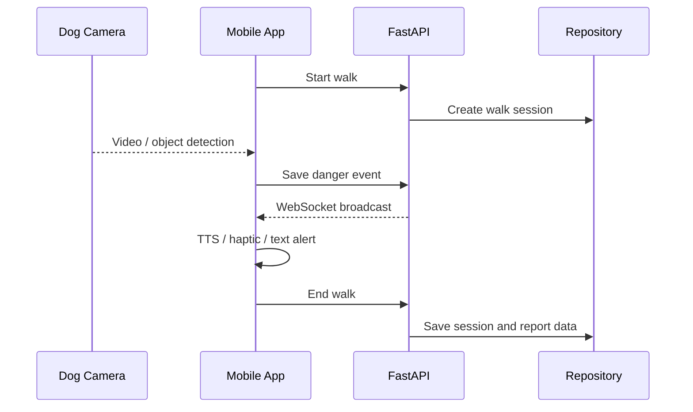

# TogeDog Docs

TogeDog 서비스의 시스템 구조, API, 데이터 모델과 설계 근거를 보관하는 문서 저장소입니다.

## Documentation Map

| 문서 | 설명 |
|---|---|
| [`ARCHITECTURE.md`](./ARCHITECTURE.md) | 앱·백엔드·AI·데이터 계층의 전체 시스템 구조 |
| [`REPOSITORY_MAP.md`](./REPOSITORY_MAP.md) | 오거나이제이션 저장소별 책임과 연결 관계 |
| [`FINAL_REPORT_COVERAGE.md`](./FINAL_REPORT_COVERAGE.md) | 77페이지 최종 산출문서의 공개 반영 위치와 제외 기준 |
| [`reference/API_명세서.md`](./reference/API_%EB%AA%85%EC%84%B8%EC%84%9C.md) | 구현된 백엔드 API Endpoint와 사용 흐름 |
| [`reference/DB_설계서.md`](./reference/DB_%EC%84%A4%EA%B3%84%EC%84%9C.md) | 회원·반려견·기기·산책·위험·생체·리포트 데이터 구조 |
| [`reference/firebase-schema.example.json`](./reference/firebase-schema.example.json) | 비밀값이 없는 Firebase 예시 스키마 |

## Service Flow

## Implementation vs. Concept

| Area | Current prototype | Future integration |
|---|---|---|
| Mobile UI | Flutter 화면과 주요 사용자 흐름 | 실제 ThinQ Design System 및 계정 연동 |
| Backend | FastAPI, Firebase/Memory Repository | 운영 인증·인가와 배포 인프라 |
| Realtime | 산책 WebSocket 이벤트 | 안정화된 영상·센서 스트리밍 |
| AI | 12-class 객체 탐지 학습·TFLite 실험, YAMNet 연결 코드 | 환경음 모델 학습·배포와 실제 착용 환경 모델 경량화 |
| Biometrics | API·데이터 구조 | 실물 센서 기반 수집·검증 |

## Notice

본 프로젝트는 LG전자 DX School 팀 프로젝트이며 실제 LG전자의 공식 제품 또는 출시 서비스가 아닙니다.
