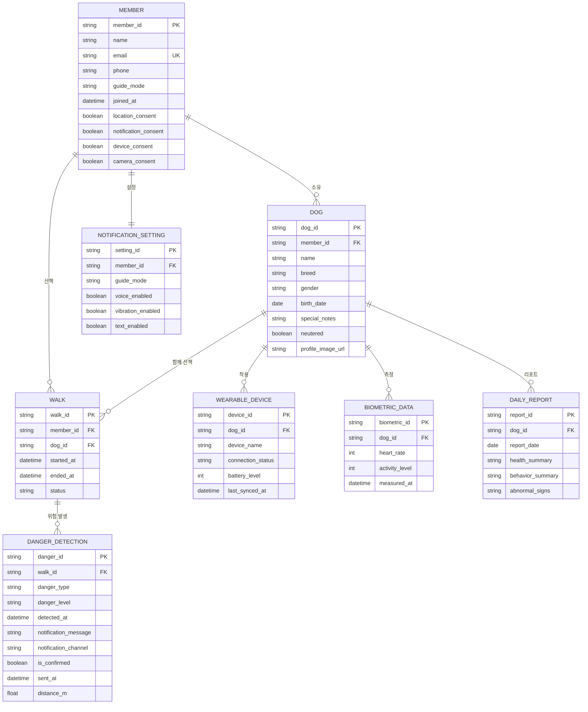

# TogeDog DB 설계서

> 기준 문서: `backend/docs/데이터_요구사항_분석서.pdf`  
> 저장소: **Firebase Realtime Database** (README 기술 스택 기준)  
> 인증: **Firebase Authentication** (비밀번호는 RTDB에 저장하지 않음)

---

## 1. ERD (엔티티 관계도)



---

## 2. 엔티티 상세 정의

### 2.1 회원 (`members`)

| 필드 | DB 키 | 타입 | 필수 | 설명 |
|------|-------|------|------|------|
| 회원ID | `member_id` | string | O | Firebase Auth `uid` 사용 |
| 이름 | `name` | string | O | 보호자 이름 |
| 이메일 | `email` | string | O | Firebase Auth와 동기화 |
| 비밀번호 | — | — | — | **Firebase Auth 전용** (RTDB 미저장) |
| 연락처 | `phone` | string | X | `010-0000-0000` 형식 |
| 안내방식 | `guide_mode` | enum | O | `VOICE` \| `VIBRATION` \| `TEXT` |
| 가입일 | `joined_at` | ISO8601 | O | UTC 기준 |
| 위치정보동의 | `location_consent` | boolean | O | 기본값 `false` |
| 알림동의 | `notification_consent` | boolean | O | 기본값 `false` |
| 기기연결동의 | `device_consent` | boolean | O | 기본값 `false` |
| 카메라동의 | `camera_consent` | boolean | O | 기본값 `false` |

### 2.2 알림유형 (`notification_settings`)

회원당 1건. 온보딩 시 선택한 안내 방식과 채널별 on/off.

| 필드 | DB 키 | 타입 | 필수 | 설명 |
|------|-------|------|------|------|
| 설정ID | `setting_id` | string | O | `member_id`와 동일 권장 |
| 회원ID | `member_id` | string | O | FK → `members` |
| 안내모드 | `guide_mode` | enum | O | `VOICE` \| `VIBRATION` \| `TEXT` |
| 음성사용여부 | `voice_enabled` | boolean | O | 소리 중심 안내 |
| 진동사용여부 | `vibration_enabled` | boolean | O | 진동 중심 안내 |
| 텍스트사용여부 | `text_enabled` | boolean | O | 텍스트 안내 |

> `guide_mode`가 `VOICE`이면 `voice_enabled=true`를 기본으로 두고, 나머지 채널은 보조 옵션으로 사용.

### 2.3 반려견 (`dogs`)

| 필드 | DB 키 | 타입 | 필수 | 설명 |
|------|-------|------|------|------|
| 반려견ID | `dog_id` | string | O | push key / UUID |
| 회원ID | `member_id` | string | O | FK → `members` |
| 이름 | `name` | string | O | 예: 콩이 |
| 견종 | `breed` | string | O | 가나다순 드롭다운 값 |
| 성별 | `gender` | enum | O | `MALE` \| `FEMALE` |
| 생년월일 | `birth_date` | date | X | `YYYY-MM-DD` |
| 특이사항 | `special_notes` | string | X | 건강·주의사항 |
| 중성화 | `neutered` | boolean | X | 기본값 `false` |
| 프로필 이미지 | `profile_image_url` | string | X | Firebase Storage URL (화면설계서 반영) |

### 2.4 웨어러블디바이스 (`devices`)

| 필드 | DB 키 | 타입 | 필수 | 설명 |
|------|-------|------|------|------|
| 기기ID | `device_id` | string | O | BLE MAC 또는 내부 ID |
| 반려견ID | `dog_id` | string | O | FK → `dogs` |
| 기기명 | `device_name` | string | O | 예: 콩이 하네스 |
| 연결상태 | `connection_status` | enum | O | 아래 enum 참고 |
| 배터리잔량 | `battery_level` | int | X | 0~100 (%) |
| 마지막동기화시간 | `last_synced_at` | ISO8601 | X | UTC |

**`connection_status` enum**

| 값 | 설명 |
|----|------|
| `DISCONNECTED` | 미연결 |
| `SEARCHING` | 탐색 중 |
| `PAIRING` | 페어링 중 |
| `CONNECTED` | 연결 완료 |
| `SYNCING` | 데이터 동기화 중 |

### 2.5 산책기록 (`walks`)

| 필드 | DB 키 | 타입 | 필수 | 설명 |
|------|-------|------|------|------|
| 산책ID | `walk_id` | string | O | push key / UUID |
| 회원ID | `member_id` | string | O | FK → `members` |
| 반려견ID | `dog_id` | string | O | FK → `dogs` |
| 시작시간 | `started_at` | ISO8601 | O | 산책 모드 시작 |
| 종료시간 | `ended_at` | ISO8601 | X | 종료 버튼 시 기록 |
| 상태 | `status` | enum | O | `IN_PROGRESS` \| `COMPLETED` \| `CANCELLED` |

### 2.6 위험감지 (`danger_detections`)

YOLO 추론 결과를 백엔드가 수신·저장. 산책 중에만 발생.

| 필드 | DB 키 | 타입 | 필수 | 설명 |
|------|-------|------|------|------|
| 위험ID | `danger_id` | string | O | push key / UUID |
| 산책ID | `walk_id` | string | O | FK → `walks` |
| 위험유형 | `danger_type` | enum | O | 아래 enum 참고 |
| 위험등급 | `danger_level` | enum | O | `LOW` \| `MEDIUM` \| `HIGH` \| `CRITICAL` |
| 감지시간 | `detected_at` | ISO8601 | O | AI 감지 시각 |
| 알림내용 | `notification_message` | string | O | TTS/텍스트용 문구 |
| 알림유형 | `notification_channel` | enum | O | `VOICE` \| `VIBRATION` \| `TEXT` |
| 확인여부 | `is_confirmed` | boolean | O | 사용자 확인 여부, 기본 `false` |
| 발송시간 | `sent_at` | ISO8601 | X | 알림 전송 시각 |
| 예상거리 | `distance_m` | float | X | 화면설계서 거리 게이지용 (m) |

**`danger_type` enum** (YOLO 탐지 클래스와 매핑)

| 값 | 설명 |
|----|------|
| `OBSTACLE` | 장애물 |
| `VEHICLE` | 차량 |
| `PERSON` | 사람 |
| `ANIMAL` | 동물 |
| `OTHER` | 기타 |

### 2.7 생체데이터 (`biometrics`)

웨어러블에서 수집. 홈 화면 실시간 상태·리포트 집계에 사용.

| 필드 | DB 키 | 타입 | 필수 | 설명 |
|------|-------|------|------|------|
| 생체데이터ID | `biometric_id` | string | O | push key |
| 반려견ID | `dog_id` | string | O | FK → `dogs` |
| 심박수 | `heart_rate` | int | O | bpm |
| 활동량 | `activity_level` | int | O | 0~100 또는 누적 스텝 |
| 측정시간 | `measured_at` | ISO8601 | O | UTC |

### 2.8 데일리리포트 (`daily_reports`)

일·주·월 리포트 화면의 기본 단위는 **일간 리포트**. 주/월은 백엔드에서 일간 데이터를 집계.

| 필드 | DB 키 | 타입 | 필수 | 설명 |
|------|-------|------|------|------|
| 리포트ID | `report_id` | string | O | `{dog_id}_{YYYY-MM-DD}` 권장 |
| 반려견ID | `dog_id` | string | O | FK → `dogs` |
| 리포트생성일자 | `report_date` | date | O | `YYYY-MM-DD` |
| 건강요약 | `health_summary` | string | O | AI/규칙 기반 요약 |
| 행동요약 | `behavior_summary` | string | O | 활동·산책 패턴 요약 |
| 이상징후 | `abnormal_signs` | string | X | 이상 징후 설명 |

---

## 3. Firebase Realtime Database 트리 구조

RTDB는 조인이 없으므로 **본문 데이터 + 조회용 인덱스 노드**를 함께 둔다.

```
togedog/
├── members/
│   └── {memberId}/
│       ├── member_id
│       ├── name
│       ├── email
│       ├── phone
│       ├── guide_mode
│       ├── joined_at
│       ├── location_consent
│       ├── notification_consent
│       ├── device_consent
│       └── camera_consent
│
├── notification_settings/
│   └── {memberId}/          # setting_id = memberId
│       ├── setting_id
│       ├── member_id
│       ├── guide_mode
│       ├── voice_enabled
│       ├── vibration_enabled
│       └── text_enabled
│
├── dogs/
│   └── {dogId}/
│       ├── dog_id
│       ├── member_id
│       ├── name
│       ├── breed
│       ├── gender
│       ├── birth_date
│       ├── special_notes
│       ├── neutered
│       └── profile_image_url
│
├── devices/
│   └── {deviceId}/
│       ├── device_id
│       ├── dog_id
│       ├── device_name
│       ├── connection_status
│       ├── battery_level
│       └── last_synced_at
│
├── walks/
│   └── {walkId}/
│       ├── walk_id
│       ├── member_id
│       ├── dog_id
│       ├── started_at
│       ├── ended_at
│       └── status
│
├── danger_detections/
│   └── {dangerId}/
│       ├── danger_id
│       ├── walk_id
│       ├── danger_type
│       ├── danger_level
│       ├── detected_at
│       ├── notification_message
│       ├── notification_channel
│       ├── is_confirmed
│       ├── sent_at
│       └── distance_m
│
├── biometrics/
│   └── {dogId}/
│       └── {biometricId}/
│           ├── biometric_id
│           ├── dog_id
│           ├── heart_rate
│           ├── activity_level
│           └── measured_at
│
├── daily_reports/
│   └── {dogId}/
│       └── {reportDate}/    # YYYY-MM-DD
│           ├── report_id
│           ├── dog_id
│           ├── report_date
│           ├── health_summary
│           ├── behavior_summary
│           └── abnormal_signs
│
└── indexes/                 # 조회 최적화용 (역참조)
    ├── member_dogs/
    │   └── {memberId}/
    │       └── {dogId}: true
    ├── member_walks/
    │   └── {memberId}/
    │       └── {walkId}/
    │           ├── started_at
    │           ├── ended_at
    │           ├── dog_id
    │           └── status
    ├── dog_walks/
    │   └── {dogId}/
    │       └── {walkId}/
    │           ├── started_at
    │           └── status
    ├── walk_dangers/
    │   └── {walkId}/
    │       └── {dangerId}/
    │           ├── detected_at
    │           ├── danger_level
    │           └── danger_type
    ├── dog_devices/
    │   └── {dogId}/
    │       └── {deviceId}: true
    └── member_latest_biometric/
        └── {dogId}/
            ├── heart_rate
            ├── activity_level
            └── measured_at
```

---

## 4. 주요 조회 패턴

| 화면/기능 | 조회 경로 | 비고 |
|-----------|-----------|------|
| 마이페이지 · 반려견 목록 | `indexes/member_dogs/{memberId}` → `dogs/{dogId}` | 다견 가정 지원 |
| 홈 · 실시간 심박/활동량 | `indexes/member_latest_biometric/{dogId}` | 최신값 캐시 |
| 홈 · 월간 산책 캘린더 | `indexes/member_walks/{memberId}` | `started_at` 날짜로 하이라이트 |
| 산책 모드 · 위험 알림 | `indexes/walk_dangers/{walkId}` | 실시간 리스너 |
| 리포트 · 일간 | `daily_reports/{dogId}/{date}` | |
| 리포트 · 주/월간 | 백엔드 집계 API | 일간 리포트 + walks + biometrics 합산 |
| 기기 관리 | `indexes/dog_devices/{dogId}` → `devices/{deviceId}` | |

---

## 5. 보안 규칙 (초안)

```json
{
  "rules": {
    "togedog": {
      "members": {
        "$memberId": {
          ".read": "auth != null && auth.uid == $memberId",
          ".write": "auth != null && auth.uid == $memberId"
        }
      },
      "dogs": {
        "$dogId": {
          ".read": "auth != null && root.child('togedog/dogs').child($dogId).child('member_id').val() == auth.uid",
          ".write": "auth != null && (!data.exists() || data.child('member_id').val() == auth.uid) && newData.child('member_id').val() == auth.uid"
        }
      },
      "walks": {
        "$walkId": {
          ".read": "auth != null && root.child('togedog/walks').child($walkId).child('member_id').val() == auth.uid",
          ".write": "auth != null && newData.child('member_id').val() == auth.uid"
        }
      },
      "biometrics": {
        "$dogId": {
          ".read": "auth != null && root.child('togedog/dogs').child($dogId).child('member_id').val() == auth.uid"
        }
      },
      "daily_reports": {
        "$dogId": {
          ".read": "auth != null && root.child('togedog/dogs').child($dogId).child('member_id').val() == auth.uid"
        }
      },
      "indexes": {
        "member_dogs": {
          "$memberId": {
            ".read": "auth != null && auth.uid == $memberId"
          }
        },
        "member_walks": {
          "$memberId": {
            ".read": "auth != null && auth.uid == $memberId"
          }
        }
      }
    }
  }
}
```

> 위험감지·생체데이터 쓰기는 **백엔드(FastAPI) Admin SDK** 경유를 권장. 클라이언트 직접 쓰기는 최소화.

---

## 6. ID·키 생성 규칙

| 엔티티 | ID 생성 방식 |
|--------|-------------|
| 회원 | Firebase Auth `uid` |
| 반려견, 산책, 위험, 생체데이터 | RTDB `push()` key |
| 알림설정 | `member_id`와 동일 |
| 데일리리포트 | `{dog_id}_{YYYY-MM-DD}` |

---

## 7. 백엔드 연동 시 다음 단계

DB 설계 완료 후 백엔드에서 구현할 API 예시:

| API | 설명 |
|-----|------|
| `POST /members` | 회원 프로필 생성 (Auth 가입 후) |
| `PUT /members/{id}/consents` | 동의 항목 업데이트 |
| `CRUD /dogs` | 반려견 관리 |
| `POST /devices/pair` | 웨어러블 페어링 |
| `POST /walks/start` · `POST /walks/{id}/end` | 산책 시작/종료 |
| `POST /danger-detections` | 딥러닝 추론 결과 수신 |
| `POST /biometrics` | 웨어러블 생체데이터 수신 |
| `GET /reports/daily` · `weekly` · `monthly` | 리포트 조회 |
| `WebSocket /ws/walks/{walkId}` | 산책 중 실시간 위험 알림 |

---

## 8. 설계 결정 요약

1. **비밀번호**는 Firebase Auth에만 두고 RTDB `members`에는 저장하지 않음.
2. **알림유형**은 회원당 1건이므로 `notification_settings/{memberId}`로 1:1 매핑.
3. **다견 가정**을 위해 `member_dogs` 인덱스로 N:M 조회 지원.
4. **주/월 리포트**는 별도 테이블 없이 일간 `daily_reports` + `walks` + `biometrics` 집계.
5. **실시간 홈 상태**는 `member_latest_biometric` 캐시 노드로 최신 생체데이터 빠른 조회.
6. **위험감지**는 산책(`walk_id`)에 종속 — 산책 외 시간에는 기록하지 않음.
